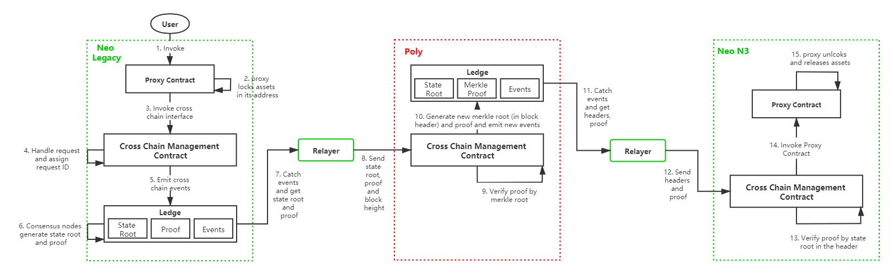

# EpicChain Migration: From EpicChain Nova to EpicChain

Welcome to the epic migration journey as we transition global assets from **EpicChain Nova** (EpicChain Nova) to **EpicChain** (EpicChain) utilizing state-of-the-art cross-chain technology. This migration represents a monumental shift towards advanced asset management and seamless cross-chain interactions. Buckle up for a journey of transformation and innovation!

## **Ascension to EpicChain / EpicPulse**

Since **EpicChain Nova** does not support direct transfer of UTXO assets into smart contracts, our strategy involves a preliminary conversion of these assets into **EpicChain** (XPR) and **EpicPulse** (XPP). Both XPR and XPP are NEP-5 contract-mapped assets specifically designed to facilitate efficient cross-chain transactions, accurate asset calculations, and advanced smart contract functionalities.

> **Important Note**: As both EpicChain (XPR) and EpicPulse (XPP) are indivisible, only whole numbers of assets can be migrated. For instance, if you hold 10.5 EpicChain (XPR), you can only migrate 10 units to EpicChain.

The conversion of assets is achieved through the `mintTokens` function. Below are code examples in various programming languages to guide you through the process:

### **JavaScript Example:**

```js
const { default: EpicVault, api, wallet, tx, u, sc, rpc, core } = require("@epicchainlabs/epicvault-js");

let outPutObj1 = {
    "assetId": "602c79718b16e442de58778e148d0b1084e3b2dffd5de6b7b16cee7969282de7",
    "value": "1022",
    "scriptHash": "f0e522806601209e9599d5e9b4dfc59773c4a882"
};

let outPutObj2 = {
    "assetId": "602c79718b16e442de58778e148d0b1084e3b2dffd5de6b7b16cee7969282de7",
    "value": "10",
    "scriptHash": "74f2dc36a68fdc4682034178eb2220729231db76"
};

let inputObj = {
    "prevHash": "f9452b21e6c079e06be717c9eded71a7d947e83f54a962e5277c7c8d56fff86c",
    "prevIndex": 1
};

const props2 = {
    scriptHash: "74f2dc36a68fdc4682034178eb2220729231db76",
    operation: "mintTokens",
    args: []
};
const script2 = EpicVault.default.create.script(props2);
let invokeTx = new EpicVault.tx.InvocationTransaction({ script: script2 });
invokeTx.addOutput(new EpicVault.tx.TransactionOutput(outPutObj1));
invokeTx.addOutput(new EpicVault.tx.TransactionOutput(outPutObj2));
invokeTx.inputs[0] = new EpicVault.tx.TransactionInput(inputObj);

invokeTx.sign("Your private key");

const rpcClient = new EpicVault.rpc.RPCClient("http://seed10.ngd.network:20332");

rpcClient.sendRawTransaction(invokeTx).then((response) => {
    console.log(response);
}).catch((err) => {
    console.log(err);
});
```

### **C# Example:**

```csharp
// UTXO input
var inputs = new List<CoinReference>
{
    new CoinReference()
    {
        PrevHash = epicList[0].txid,
        PrevIndex = (ushort)epicList[0].n
    }
}.ToArray();

long amount = 100_2345_6789;
// UTXO output
var outputs = new List<TransactionOutput>
{
    new TransactionOutput()
    {
        AssetId = Blockchain.UtilityToken.Hash,
        ScriptHash = EPICPulse,
        Value = new Fixed8(amount) // Amount
    },
    new TransactionOutput()
    {
        AssetId = Blockchain.UtilityToken.Hash,
        ScriptHash = User.ScriptHash,
        Value = Fixed8.FromDecimal(epicList[0].value) - new Fixed8(amount) // Amount
    }
}.ToArray();

// Construct a transaction
Transaction tx = null;
using (ScriptBuilder sb = new ScriptBuilder())
{
    // EpicChain
    sb.EmitAppCall(UInt160.Parse("0xf46719e2d16bf50cddcef9d4bbfece901f73cbb6"), "mintTokens"); // The contract function mintTokens
    // EpicPulse
    // sb.EmitAppCall(UInt160.Parse("0x74f2dc36a68fdc4682034178eb2220729231db76"), "mintTokens");
    tx = new InvocationTransaction
    {
        Version = 1,
        Script = sb.ToArray(),
        Outputs = outputs,
        Inputs = inputs,
        Attributes = new TransactionAttribute[0],
        Witnesses = new Witness[0]
    };
}

// User signature
tx.Attributes = Helper.GetAttribute(User.ScriptHash);
var signature = tx.Sign(keyPair);
tx.Witnesses = Helper.GetWitness(signature, keyPair.PublicKey);

// Send the transaction
byte[] data = tx.ToArray();
string rawdata = data.ToHexString();
string result = Helper.InvokeRpc(url, "sendrawtransaction", rawdata);
```

### **Java Example:**

```java
EpicVault epv = EpicVault.build(new HttpService("http://seed1.ngd.network:20332")); // EpicChain test net
Account account = Account.fromWIF("your wif string").build();
// EpicChain contract hash on EpicChain testnet
ScriptHash epicChainHash = new ScriptHash("0x17da3881ab2d050fea414c80b3fa8324d756f60e");
account.updateAssetBalances(epv);
ContractInvocation invoc = new ContractInvocation.Builder(epv)
        .contractScriptHash(epicChainHash)
        .function("mintTokens")
        .account(account)
        .output(new RawTransactionOutput(EpicChainAsset.HASH_ID, lockValue, epicChainHash.toAddress()))
        .build()
        .sign()
        .invoke();
String txHash = invoc.getTransaction().getTxId();
```

## **EpicCross Architecture**

Our migration process leverages sophisticated cross-chain technology to ensure a flawless transition of assets. The architecture encompasses several critical components:



### **Components of the Architecture:**

- **EpicChain Nova**: The legacy blockchain from which assets are being migrated.
- **EpicChain**: The advanced blockchain to which assets are being transferred.
- **[Poly Cross Chain](https://github.com/polynetwork/docs/blob/master/poly/README.md)**: This bridge network connects sidechains, with nodes operated by diverse entities to ensure decentralized governance and trust.
- **Relayer**: Facilitates cross-chain transactions and monitors for relevant events, earning rewards for its efforts.
- **Cross Chain Management Contract (CCMC)**: Manages cross-chain operations including request processing, transaction verification, and event broadcasting.
- **Proxy Contract**: Oversees the locking and unlocking of assets between sidechains.
- **User**: Includes all entities participating in the migration, such as exchanges, individuals, and wallets, initiating transactions via the proxy contract.

## **Migration Process Flow**

To initiate the migration, you need to register sidechains and Relayers, and bind assets on both ends. The typical process flow is as follows:

### **On EpicChain Nova Side:**

1. **Invoke Proxy Contract:** Call the `lock` method on EpicChain Nova.

   > **Note**: For code examples, refer to the [C# demo](https://github.com/epicchainlabs/epicchain-crosschain/blob/main/CrossChainDemo/Demo.cs) and [Java demo](https://github.com/epicchainlabs/epicchain-crosschain/tree/main/CrossChainDemo_Java/src/main/java/crosschain/demo).

2. **Lock Assets:** The proxy contract locks the assets designated for migration.

3. **Invoke CCMC:** The proxy contract triggers the `crossChain` method of CCMC.

4. **Generate Request ID:** CCMC creates and logs a `Request ID`.

5. **Send Cross-Chain Event:** CCMC broadcasts a cross-chain event.

6. **Generate State Proof:** Consensus nodes generate a state root and proof of the transaction.

7. **Relayer Captures Event:** The Relayer monitors sidechain blocks for the cross-chain event.

8. **Send Proof to Poly:** The Relayer submits the state root and proof to Poly.

### **On Poly Side:**

9. **Verify Proof:** CCMC on Poly validates the proof using the `from chain ID`.

10. **Construct New Proof:** Poly generates a new state root and proof, then broadcasts a cross-chain event.

### **On EpicChain Side:**

11. **Relayer Captures Event:** The Relayer monitors Poly blocks for the cross-chain event.

12. **Invoke CCMC:** The Relayer invokes the `verifyAndExecuteTx` method of CCMC to construct the transaction.

13. **Verify Proof:** CCMC verifies the proof received from Poly.

14. **Unlock Assets:** CCMC calls the `UnlockAsset` method of the EpicChain proxy contract.

15. **Release Assets:** The proxy contract releases assets to the user's EpicChain address.

## **Transfer Verification**

To ensure the successful transfer of assets, follow these steps:

1. **Retrieve Block Details:** Use the [getblock](https://epic-chain.org) API to

 fetch details about the blocks and transactions.

2. **Analyze Transactions:** Use the [getapplicationlog](https://epic-chain.org) API to review transaction logs and verify deposits.

### **Invoking getapplicationlog**

Ensure that the [ApplicationLogs plugin](https://github.com/epicchainlabs/epicchain/releases/download/v3.0.0-rc2/ApplicationLogs.zip) is installed and that the epicchain-cli node is active. Logs will be available in the "ApplicationLogs" directory.

**Example API Response:**

```json
{
    "jsonrpc": "2.0",
    "id": 1,
    "result": {
        "txid": "0xd9aaa1243cae91e063a140239807a9de45f82850130ec36403f44770955dd2d7",
        "trigger": "Application",
        "vmstate": "HALT",
        "gasconsumed": "11819770",
        "stack": [],
        "notifications": [
            {
                "contract": "0xd2c270ebfc2a1cdd3e470014a4dff7c091f699ec",
                "eventname": "Transfer",
                "state": {
                    "type": "Array",
                    "value": [
                        {
                            "type": "ByteString",
                            "value": "uXtKzX+CD2HS1NT5rqXrUEmN31U="
                        },
                        {
                            "type": "ByteString",
                            "value": "7ztGBn8vR7L38EQqojcghdCHCO8="
                        },
                        {
                            "type": "Integer",
                            "value": "800000000000"
                        }
                    ]
                }
            }
        ]
    }
}
```

> **Important Note**: Verify the transaction's success by checking the "vmstate" parameter. "HALT" indicates a successful transaction, while "FAULT" signifies a failure.

**Transaction Parameters:**

- **contract**: Script hash of the XEP asset (e.g., "0xd2c270ebfc2a1cdd3e470014a4dff7c091f699ec").
- **eventname**: Identifier for the transfer event.
- **state**: Includes:
  - **From Account**: Source address (decoded from base64).
  - **To Account**: Destination address (decoded from base64).
  - **Amount**: Transfer amount (e.g., 800000000000 converts to 8000.00000000).

> **Note**: For data format conversions, see [EpicChain data conversion](https://epic-chain.org/converter/index).

Embark on this epic migration adventure with confidence, knowing that your assets will transition seamlessly to EpicChain. Happy migrating!
